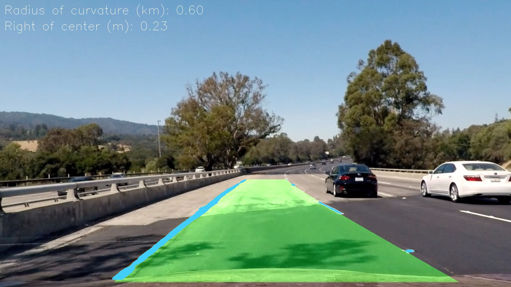
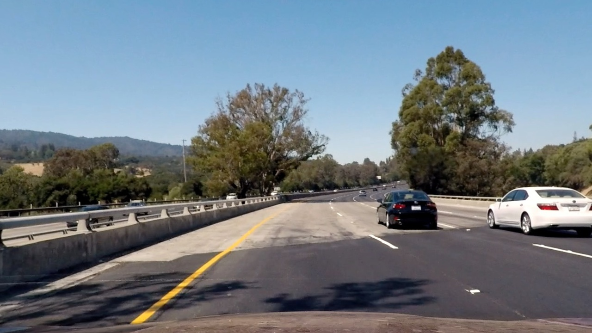
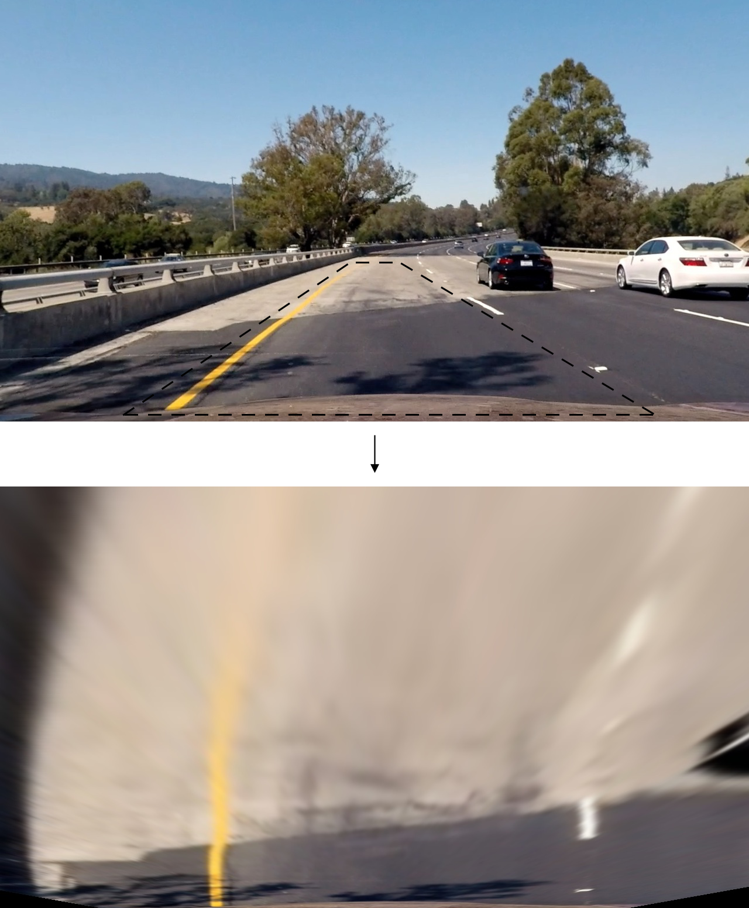
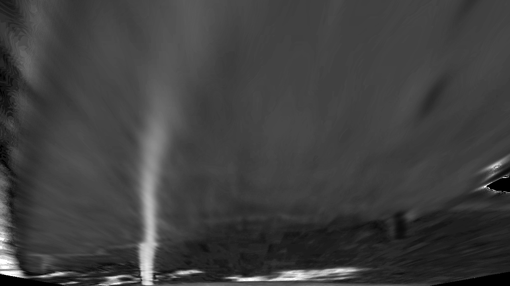
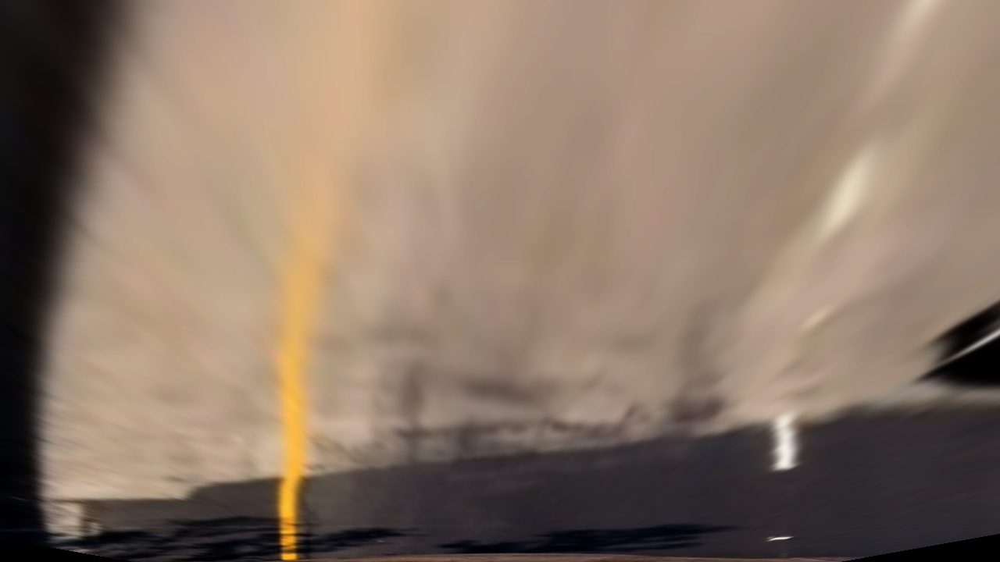
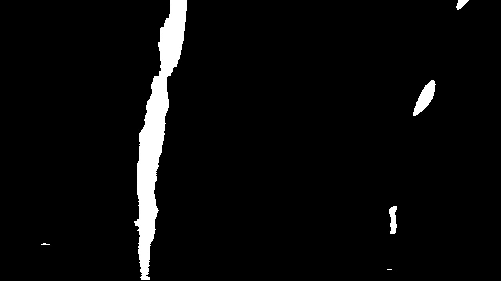
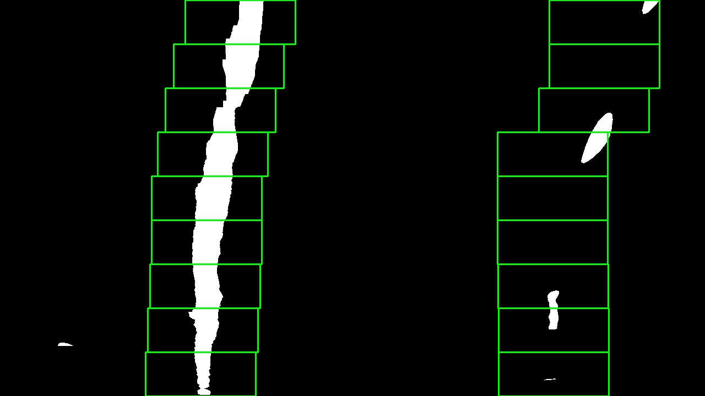
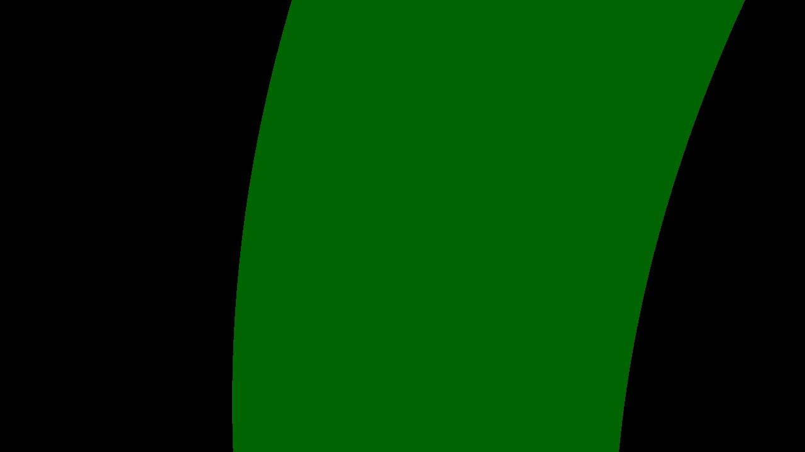
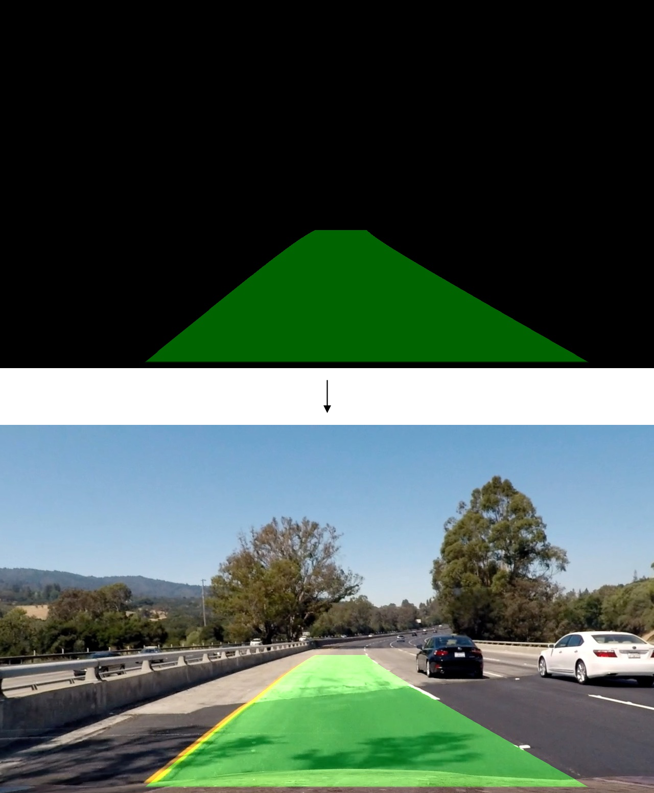

## Traffic Lane Detection using Color Space Thresholding

This project uses perspective transform and color space thresholding to perform traffic lane detection from an image or video capture of a camera mounted in the center of a vehicle. The detection pipeline outputs the radius of curvature of the detected lane, how far off center the vehicle is, and highlights the area within the capture deemed to be a lane. Click on the image below for a video of the detection system in use during highway driving. A write-up is also available at [www.lrgonzales.com/traffic-lane-detection](http://www.lrgonzales.com/traffic-lane-detection).

The lane detection pipeline primarily consists of the following steps, which are elaborated on in the remainder of the write-up:
* Distortion correction
* Perspective transform
* Color space thresholding
* Lane segmentation
* Drawing

Fig. 1 will serve as a reference image for the processing steps to be discussed.

  

  
Fig. 1: Input reference image.

### Introduction
Lane detection is a safety-critical component of a self-driving vehicle. While it is relatively easy for humans to identify traffic lanes, a machine lacks the contextual information that we often take for granted. Adding to the challenge are varied patterns and colors of lane demarcations in the real-world, along with construction and uneven road surfaces. Moreover, it’s critical that a detection system be robust to varied weather and lighting conditions.

### Distortion Correction
Distortion is a common artifact in present-day camera lenses. It is typically associated with large-range zoom lenses but can also be found in low-end, inexpensive lenses. Wide-angle lenses also suffer from distortion. The types of distortion present in these cases are radial defects and can be corrected for in software using 2-dimensional transformations. Because one of the goals of this pipeline is to capture the radius of curvature, it is critical to correct for any distortion from the start.

While high-level image processing software (e.g., Adobe Photoshop) may store the necessary parameters for distortion correction of popular cameras, it is also possible to obtain these parameters by using lower-level packages. OpenCV was used to obtain the proper parameters and was used to undistort the input image, as shown in Fig. 2. Comparing with Fig. 1, note that most of the correction is noticeable along the edges of the image, such as the white car on the right.

  

  
Fig. 2: Original image corrected for distortion.

### Perspective Transform
Having a bird’s-eye view of the road would simplify the task of measuring the lane curvature. However, the center-mounted camera captures the road ahead in 3-dimensional space. A perspective transform can help with mapping between these two spaces, as shown in Fig. 3. One limitation of the implemented method is that it does not compensate for any slope of the road itself.

  

  
Fig. 3: Mapping 3D to 2D using perspective transform.

### Color Space Thresholding
Given that the focus of the detection pipeline is on lane lines, the next step is to create a binary image that emphasizes pixels that correspond to lane markings. Intuitively, this could be accomplished through RGB thresholding, as lane markings are expected to be either yellow or white. However, RGB thresholding is known to perform poorly under wide ranges of brightness for any given color (e.g., markings under shadows versus direct sunlight). For this reason, it’s helpful to perform thresholding using a different color space that is more invariant to differing levels of brightness.

Fig. 4 shows the S channel (in grayscale) of the HSV representation of perspective-transformed Fig. 3. Note that this particular channel helps emphasize the yellow markings, even across the varying road types. Ultimately, various combinations of color spaces and corresponding thresholds can be combined to reliably pick out the white and yellow lane markings. Note that it’s possible to perform the thresholding prior to the perspective transform, but, because the perspective transform also performs interpolation, another threshold would be needed.

  

  
Fig. 4: S channel of HSV color space.

Despite using color spaces that may be less sensitive to brightness variations, the range of environments in the real-world can often be too wide for color spaces alone to solve the problem. For example, take the difference between driving on a sunny day on a road with no shade versus driving on a cloudy day under an overpass or tunnel with poor lighting. Because of these extremes, gamma correction [1] was implemented on the original RGB image before color space transformation and thresholding. The value of gamma is determined based on the mean brightness (Y channel from YUV colorspace). A high value for mean brightness corresponds to a low value for gamma and vice-versa. Fig. 5 shows a gamma-corrected version of Fig. 3 where the light-colored concrete led to a low value for gamma and a darkening of the image. It is on the image in Fig. 5 that color space conversions and thresholding would be performed.

  

  
Fig. 5: Gamma correction with light-colored concrete resulting in a darkening of image.

Having implemented gamma correction and taken advantage of the RGB, YUV, and HSV color spaces, the final binary image emphasizing pixels corresponding to lane markings is shown below.

  

  
Fig. 6: Binary image emphasizing lane markings.

### Lane Segmentation
Given a binary image as shown in Fig. 6, the next step is to segment pixels that correspond to the left and right lane lines. First, x-coordinates corresponding to the bottom of the image for each lane are estimated and then a sliding-windows search is performed. In order to find these two x-coordinates, a column-wise count of white pixels is taken for the bottom half of the image. The two maximums of this column-wise count are taken to represent the x-coordinates of each lane. Fig. 7 shows a visualization of this step, where the left lane would be taken to start from the bottom of the image at x = 364 and the right lane at x = 1005.

  

  
Fig. 7: Column-wise count of bottom-half of binary image having a width of 1280.

Once these coordinates are determined, a sliding-windows search begins at the bottom of the image by placing a window at the determined x-coordinates for each lane. Subsequent windows are shifted if the previous window had more than a certain number of pixels. A visualization is shown in Fig. 8. The sliding-windows search is parameterized by a window count and a window width. The window height is determined by the overall image height and the window count. Fig. 8 shows an example of a window count of nine.

  

  
Fig. 8: Sliding-windows search.

With pixels now segmented between left and right lane lines, each is fit to a second-order polynomial. The polynomials are used to determine how far off center the vehicle is and the radius of curvature of the detected lane. It’s worth noting that in the case of video capture, it’s possible to use the polynomial fit from a previous frame to guide the lane search of a present frame such that the sliding-windows search can be skipped.

### Drawing
With a second-order polynomial fit to each lane line, a polygon can be defined as the area enclosed by the two polynomials and the top and bottom of the image. This area represents the portion of road that is deemed to be a lane in the bird’s-eye view.

  

  
Fig. 9: Area designated as lane in bird’s-eye view.

In order to overlay this polygon on the original (curvature-corrected) image, the inverse perspective transform from earlier is needed. The figure below shows the inverse perspective transform performed on Fig. 9 along with an overlay on the curvature-corrected image.

  

  
Fig. 10: Inverse perspective transform and overlay.

### Improvements
Color space thresholding is arguably the most critical and sensitive aspect of the detection pipeline, so any improvements would be best directed in that portion of the pipeline. Finer tuning of the thresholding parameters could help, but what would probably help more is correcting for brightness. One technique that seems favorable over gamma correction is adaptive histogram equalization [2]. It would also be interesting to see the results of replacing the entire pipeline with a deep learning approach.

### Usage
The parameters from the camera calibration routine are uploaded to the repository as `pickled_cal_params`. If one desires to run the calibration routine again, run `python src/calibration.py <dir> <n_col>, <n_row>`, where `<dir>` is the directory to checkerboard images (e.g., `calibration_imgs`), and `<n_col>` and `<n_row>` are the number of intersecting columns and rows (e.g., 9 and 6) in the checkerboard, respectively.

To perform lane detection on `<file>`, run `python src/main.py <file>`. The file to perform detection on may be either a `jpg` or an `mp4`.

### Dependencies
The project makes use of the following Python packages: `numpy`, `matplotlib`, `opencv`, `sys`, `pickle`, `glob`, `collections`, and `moviepy`.

### References
[1] [OpenCV Gamma Correction, PyImageSearch, A. Rosebrock, 2015](https://www.pyimagesearch.com/2015/10/05/opencv-gamma-correction/)

[2] [Adaptive histogram equalization, Wikipedia](https://en.wikipedia.org/wiki/Adaptive_histogram_equalization)
